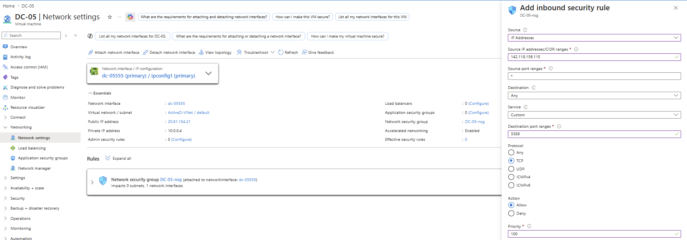
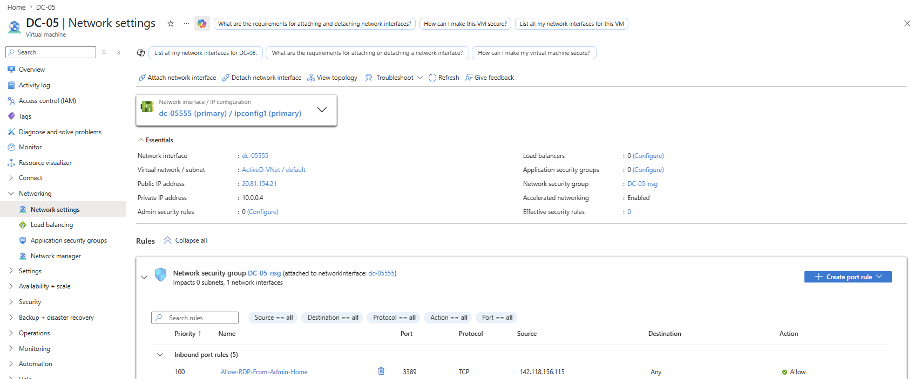
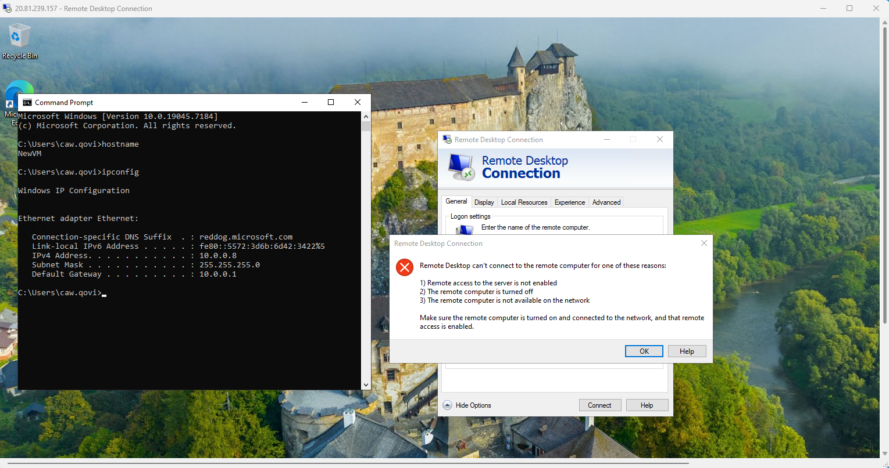
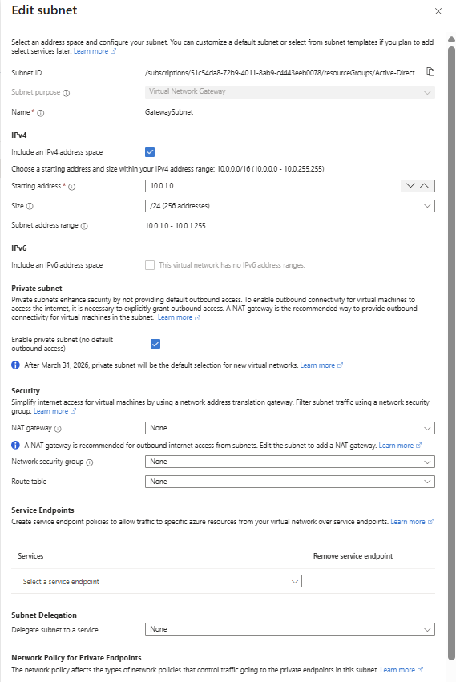
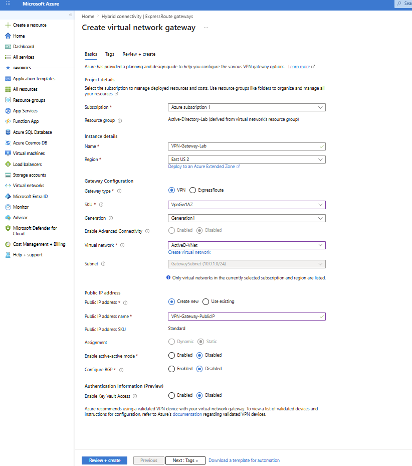
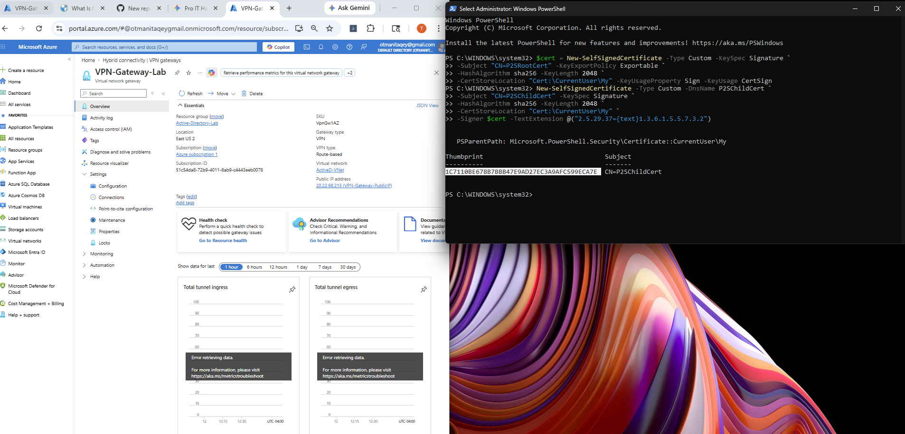
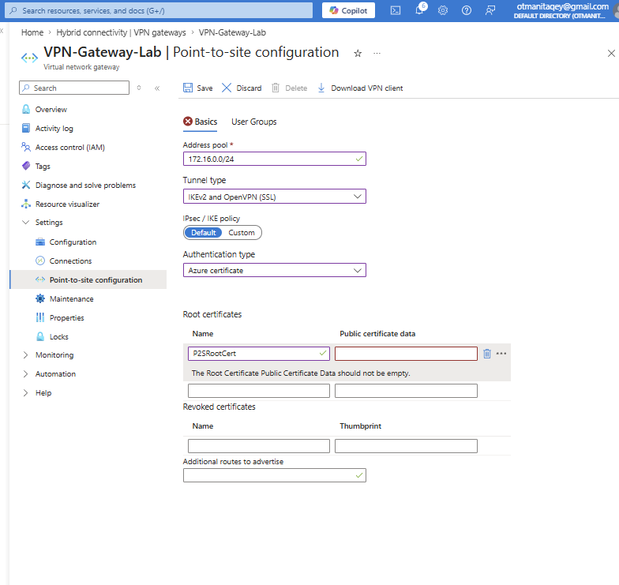
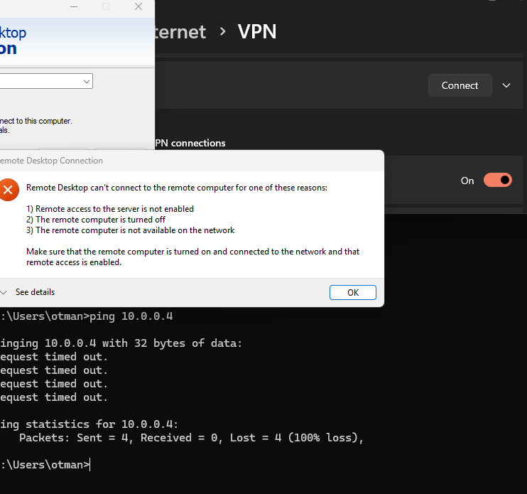
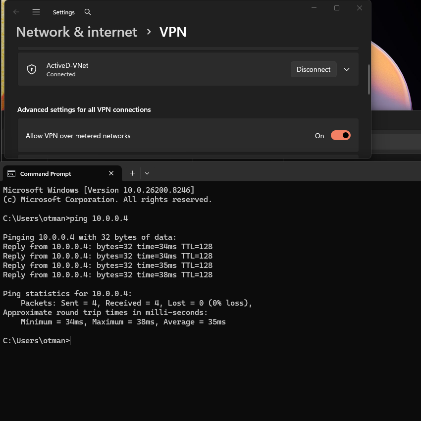
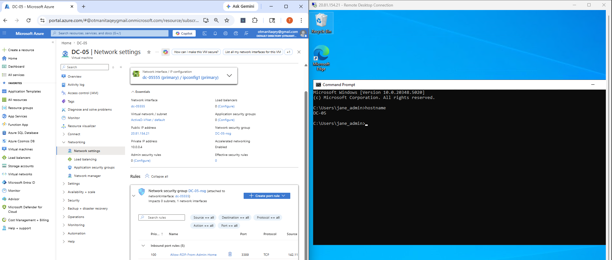

# Azure Cloud Infrastructure: Perimeter Hardening & Point-to-Site VPN Implementation

## 1. Project Overview
This project focuses on the **Security Life Cycle** of a cloud-hosted Domain Controller (DC-05). In its initial state, the server was vulnerable to external brute-force attacks due to open management ports. 

I executed a two-stage hardening strategy to transition the environment to a **"Zero-Exposure"** model. This involved moving from basic IP Whitelisting (Phase 1) to a fully encrypted Hybrid Connectivity tunnel using a Point-to-Site VPN (Phase 2).

---

## 2. Technical Environment & Tools
* **Cloud Platform:** Microsoft Azure
* **Infrastructure:** Virtual Network (ActiveD-VNet), Windows Server 2022 (DC-05)
* **Networking:** Virtual Network Gateway (VpnGw1), GatewaySubnet
* **Security:** Network Security Groups (NSG), Ingress/Egress Rules
* **PKI/Encryption:** PowerShell Certificate Services (Self-Signed Root & Client Certs)
* **Connectivity:** OpenVPN / IKEv2 Protocols

---

## 3. Phase 1: Attack Surface Reduction (NSG Lockdown)

### Step 1: Ingress Rule Hardening
I identified that the server was listening for RDP traffic from "Any" source. I immediately restricted this by creating a **Priority 100** rule to whitelist only my administrative Public IP.

### Step 2: Verification of Denial
To ensure the firewall was active, I attempted to connect from a secondary machine (`NewVM`) on an external network. The connection was successfully dropped, proving the "Explicit Allow" logic was functional.

* **Evidence of Denial:**

---

## 4. Phase 2: VPN Implementation (Hybrid Tunneling)

### Step 1: Gateway Infrastructure
To eliminate the need for any public-facing RDP ports, I provisioned a **Virtual Network Gateway**. This required the creation of a dedicated `GatewaySubnet` (10.0.1.0/24) to handle the encrypted traffic.

* **Deployment Progress:**

### Step 2: PKI Certificate Generation
Security was enforced using Certificate-Based Authentication. I used **PowerShell** to generate a Root Certificate (The Lock) and a Client Certificate (The Key). The Root Certificate's public data was uploaded to Azure to act as the authentication authority.

**Certificate Data Setup:** 
  

**PowerShell Execution:** 
  

### Step 3: Point-to-Site Configuration
I established a VPN Address Pool (172.16.0.0/24) to ensure that VPN clients are assigned a dedicated internal range, which I then whitelisted in the DC-05 NSG.

**P2S Addressing:** 

---

## 5. Final Security Audit & Results

### The "Zero-Trust" Verification
To conclude the lab, I performed a final audit to prove that the server was now invisible to the public internet but accessible via the secure tunnel.

1. **VPN Disconnected:** Connection attempts to the server failed entirely.

2. **VPN Connected:** A secure tunnel was established, allowing for a successful ICMP ping and RDP session via the **Private IP (10.0.0.4)**.

### Final Session Success
The final image confirms a successful RDP session to the internal hostname `DC-05` through the encrypted VPN tunnel.

**Secure Management Session:** 
  

---

## 6. Key Takeaways
* **Reduced Risk:** Eliminated 100% of public-facing management ports.
* **Encryption:** Secured all admin traffic within an SSL/IKEv2 tunnel.
* **Compliance:** Implemented the **Principle of Least Privilege** for network access.

---

**Developed by [Taki] | Systems Infrastructure & IT Operations Portfolio**
